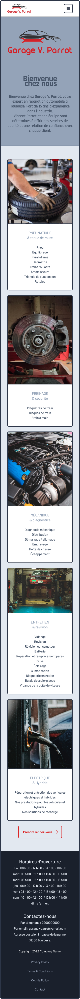

# A. Spécifications techniques

### Serveur

* prospection à faire !!!

### Pour le front

* HTML 5
* CSS 3
* Tailwindcss
* React.js

### Pour le back

* PHP 8.2
* Symfony 6.3
* API Platform
* Mysql

# B. Diagramme de cas d'utilisation 

# C. Diagramme de séquence

# D. Diagramme de classe

# E. Maquette du Desktop

# D. Maquette du Mobile

