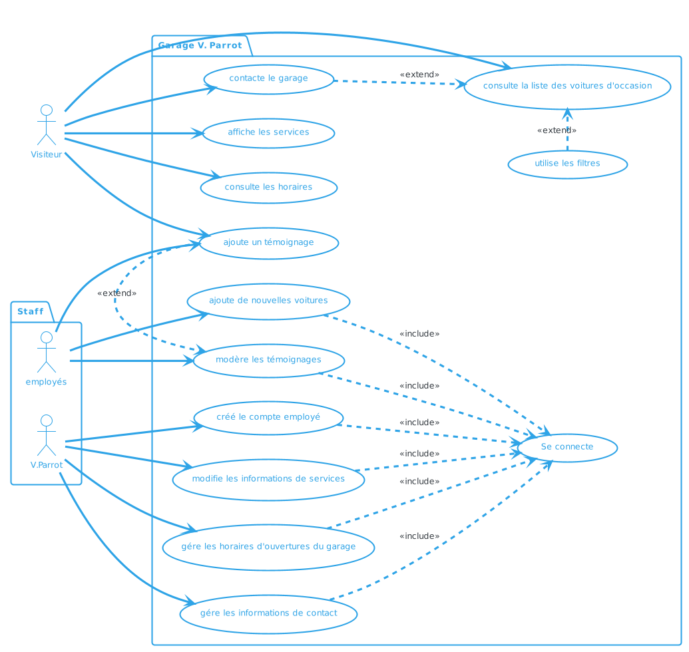
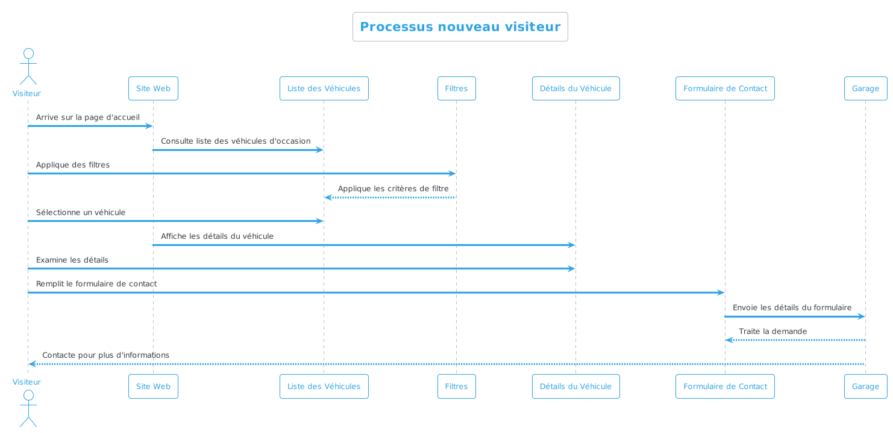
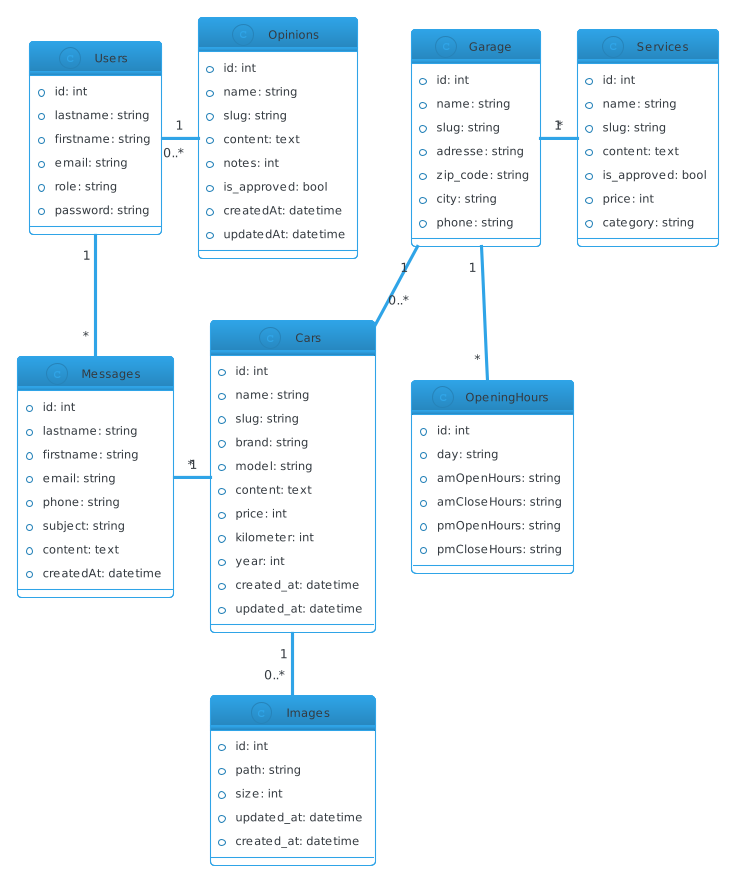
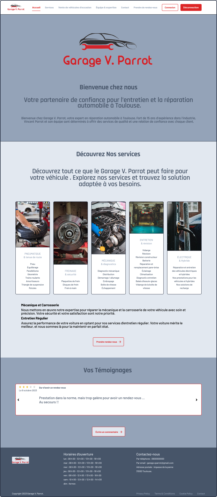

# A. Spécifications techniques

### Serveur

* prospection à faire !!!

### Pour le front

* HTML 5
* CSS 3
* Bootstrap pas prévu mais ça peut changer
* JavaScript avec ou sans React.js ??

### Pour le back

* PHP 8.2
* Symfony 6.3
* API Platform ?? à voir
* Mysql

# B. Diagramme de cas d'utilisation 

# C. Diagramme de séquence

# D. Diagramme de classe

# E. Maquette du Desktop

